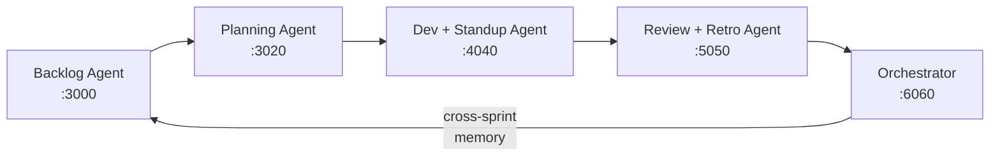

# We Built 5 AI Agents That Run Your Entire Sprint -- Here's What Happened

Every two weeks, the same cycle repeats. Tickets enter the sprint half-baked. The team over-commits. PRs merge without anyone checking acceptance criteria. The retro produces the same three action items as last time. Nobody follows up. Next sprint, repeat.

**We asked: what if AI didn't just assist Agile teams -- what if it actually ran the ceremonies?**

Not a chatbot. Not a summary tool. A system of specialized agents that refine your backlog, plan your sprint, evaluate every deliverable, run the retro, and *remember what happened* so next sprint is better than this one.

> **TL;DR:** We built a multi-agent AI orchestrator that automates all 7 Agile sprint phases -- from backlog refinement to intelligence reporting. Each agent has its own dashboard. A central orchestrator coordinates them, maintains cross-sprint memory, and generates strategic insights for POs and Scrum Masters.

---

## The Pain

If you've worked in Agile, you know these:

**Backlog chaos.** Tickets enter sprints without acceptance criteria, estimates, or dependency mapping. Teams discover missing requirements mid-sprint.

**Planning by gut feel.** Nobody connects actual capacity to historical velocity. Result: 30-40% spillover rates, every sprint.

**Invisible quality.** Work product quality is a mystery until the review demo. "Done" doesn't mean "done right."

**Amnesia.** Every sprint starts from zero. The retro insights from three sprints ago? Gone. The same patterns repeat for months.

The data to fix all of this exists -- in JIRA, GitHub, Teams transcripts, and team memory. But nothing connects it.

---

## The Idea

What if every Agile ceremony had a dedicated AI agent, and a central brain coordinated all of them?



Five services. Seven phases. One pipeline. Real-time streaming. Persistent memory across sprints.

---

## What Each Agent Actually Does

### Backlog Agent -- *For the Product Owner*
Takes raw requirements (pasted, CSV, or fetched from JIRA) and transforms them into sprint-ready tickets. Validates against JSON schema, estimates story points from historical similarity, detects dependencies, and flags risks. Every decision is audit-logged.

### Sprint Planning Agent -- *For the Scrum Master*
Loads the refined backlog, reads historical velocity, and builds an optimal plan within team capacity. If past sprints show overcommitment, it automatically reduces suggested capacity. Uses Azure OpenAI + RAG to match tickets to team members.

### Iterative Dev + Standup Agent -- *For the Team*
Processes daily standup transcripts (pasted or fetched from Microsoft Teams) and extracts per-developer updates, blockers, and at-risk tickets. Evaluates work products against acceptance criteria using a rule engine -- no LLM hallucination on pass/fail decisions.

### Review + Retro Agent -- *For PO and Scrum Master*
Evaluates every sprint deliverable through a 3-layer pipeline:
1. **Rule Engine** -- deterministic acceptance criteria check
2. **Foundry Local** -- on-device AI extraction (phi model, zero data leaves the machine)
3. **Azure OpenAI** -- LLM-powered decision with confidence scoring

Then runs a data-driven retrospective: pattern detection, action items with owners, velocity charts, CSV export.

### The Orchestrator -- *The Brain*
Coordinates all agents through a 7-phase pipeline (Backlog, Planning, Development, Review, Retro, Velocity, Intelligence). Maintains **cross-sprint memory** -- velocity, completion rates, retro actions, recurring patterns. Each sprint learns from the last.

<!-- Add screenshot: orchestrator dashboard showing all 7 phases -->

---

## The Differentiator: Sprints That Learn

Most tools treat each sprint as isolated. We don't.

After every cycle, the orchestrator persists what happened -- which tickets spilled over, which retro items were never addressed, how estimates compared to actuals. The next sprint's planning phase automatically consumes this context.

> After 3 cycles, the system suggested reducing capacity by 15% because historical data showed consistent overcommitment. No human asked for this. The memory surfaced it automatically.

It also detects **cross-phase correlations** that humans miss:
- Overcommitment in planning correlating with spillover in review
- Recurring retro patterns that were never addressed
- Estimation drift on certain ticket types

An **AI Manager** layer evaluates team performance trends across sprints -- velocity, quality, predictability, and action follow-through -- giving POs and Scrum Masters a strategic view.

---

## The Bug That Almost Killed the Demo

Here's a war story. During testing, every sprint showed **0% completion**. Every ticket failed. We spent hours debugging.

The root cause? One character.

```javascript
// BEFORE: 0 is falsy in JavaScript, so 0 || 100 = 100 (failure!)
Number(review.metrics?.testFailureRatePercent || 100) === 0;

// AFTER: ?? only falls back on null/undefined, not 0
Number(review.metrics?.testFailureRatePercent ?? 100) === 0;
```

A `testFailureRatePercent` of `0` (perfect score) was being treated as `100` (total failure) because `0` is falsy in JavaScript. Changing `||` to `??` -- one character -- fixed the entire system.

**Lesson:** Always use nullish coalescing (`??`) for numeric values. `||` will betray you.

---

## Responsible AI -- Not an Afterthought

Every AI decision in the system includes:

- **Transparency** -- Each output lists its data sources (RuleEngine, FoundryLocal, AzureLLM, RAG) and a confidence score (0-100). Nothing is a black box.
- **Safety** -- All inputs are sanitized. Rate limiting at 60 req/min. RBAC with public/supervisor/admin roles. LLM outputs are validated before display.
- **Accountability** -- Per-agent audit logs with timestamps. A Responsible AI Dashboard aggregates events, flags, and data sources across all agents.
- **Offline Mode** -- One toggle switches the entire system to Foundry Local + Ollama. Zero data leaves the machine. Critical for enterprises with sensitive sprint data.

<!-- Add screenshot: Responsible AI dashboard -->

---

## Tech Stack

- **Runtime:** Node.js 20+, Express.js
- **LLM (Cloud):** Azure OpenAI GPT-4o via LangChain.js
- **LLM (Local):** Microsoft Foundry Local (phi model)
- **Embeddings:** Ollama nomic-embed-text for RAG
- **Protocol:** MCP (Model Context Protocol) -- 11 tools exposed to VS Code / Copilot / Claude Desktop
- **Frontend:** React 18 (CDN) + Chart.js, unified dark theme across 5 dashboards
- **Integrations:** JIRA Cloud, GitHub REST, Microsoft Graph
- **Deploy:** Azure Developer CLI (azd) + Container Apps + Bicep IaC

---

## Try It Yourself

```bash
git clone https://github.com/snehasankaran/agile-sprint-orchestrator.git
cd agile-sprint-orchestrator
npm install
cp .env.example .env   # Add your API keys

# Start all 5 services
node backlog_agent_final.js       # :3000
node sprint_planning_agent.js     # :3020
node iterative_standup_agent.js   # :4040
node review_agent.js              # :5050
node orchestrator.js              # :6060
```

Open `http://localhost:6060`. Click **Run Full Cycle**. Watch all 7 phases execute in real-time.

<!-- Add screenshot: full cycle running with SSE events streaming -->

---

## Built With AI

This project was built with **Cursor (Claude)** throughout -- architecture, code generation, debugging, and this blog post. Our approach:

- Started with high-level intent ("build a sprint review agent") and iterated with focused follow-ups
- Used AI for debugging: the `??` bug, proxy issues, and cross-sprint memory parsing were all diagnosed through iterative prompting
- Breaking complex tasks into small, specific prompts worked better than large "build everything" prompts

---

## What's Next

- WebSocket for bidirectional communication (replacing one-way SSE)
- Proper event bus (Redis/NATS) for production scale
- End-to-end integration tests across all 5 agents
- Fine-tuned local models for domain-specific evaluation

---

## Links

- **GitHub:** [snehasankaran/agile-sprint-orchestrator](https://github.com/snehasankaran/agile-sprint-orchestrator)
- **Video Demo:** *(add YouTube/Vimeo link)*

---

*Built for the JavaScript AI Build-a-thon Hack 2026 -- Agents for Impact*
