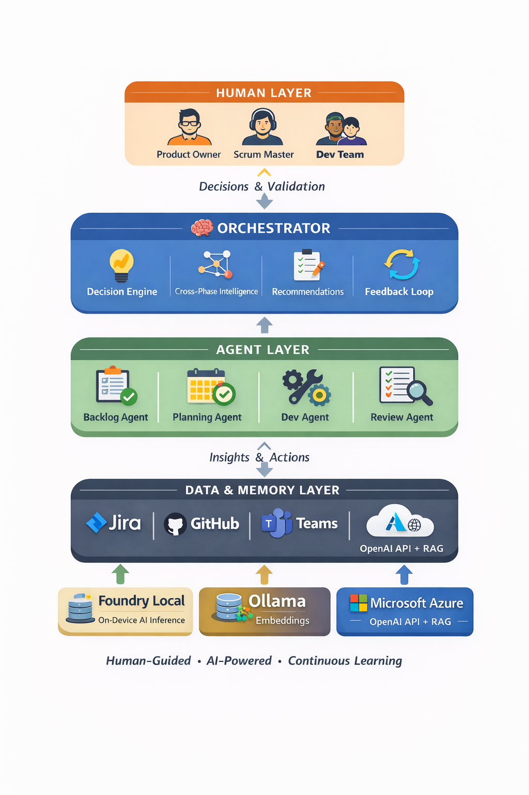

# Agile Sprint Orchestrator


> *We don't track sprints. We predict and optimize them.*

## Sprints Don't Fail at the End — They Fail on Day 1

By the time a sprint "fails", it's already too late. Overloaded developers go unnoticed. Hidden dependencies surface mid-sprint. Velocity is guessed, not predicted. Teams don't lack tools — they lack **intelligence**.

**Agile Sprint Orchestrator is an AI system that predicts sprint failure before it happens — and autonomously fixes it.**

It is a multi-agent decision system that simulates sprint outcomes before execution, detects risk in real-time, learns from every past sprint, and continuously optimizes team performance.

---

## Why This Is Different

Unlike traditional Agile tools that track what already happened, this system:

- **Predicts the future** — Monte Carlo simulation (10,000 runs) forecasts sprint completion probability
- **Learns from the past** — Cross-sprint memory feeds retro patterns into next planning cycle
- **Acts in the present** — Real-time risk detection, workload rebalancing, and AI recommendations

It doesn't manage sprints. It **runs them intelligently**.

---

## Decision Intelligence Engine

Every decision flows through a 3-layer reasoning system:

| Layer | Role | Why |
|-------|------|-----|
| **Rule Engine** | Deterministic validation | Reliability — catches known patterns instantly |
| **Local AI (Foundry Local phi)** | Fast, private reasoning | Speed + Privacy — no data leaves the machine |
| **Cloud LLM (Azure OpenAI GPT-4o)** | Deep contextual intelligence | Depth — handles nuance and complex trade-offs |

This ensures speed, privacy, intelligence, and reliability in every decision. **Offline Mode** switches the entire pipeline to local models (Foundry Local + Ollama) — zero data leaves the machine, critical for enterprises with sensitive sprint data.

---

## Multi-Agent Architecture

Five specialized agents coordinated by a central Orchestrator through a 7-phase pipeline:

`Backlog → Planning → Development → Review → Retro → Velocity → Intelligence`

| Agent | What It Does |
|-------|-------------|
| **Refinement Agent** | Dynamically validates tickets, estimates effort using historical similarity, and surfaces hidden dependencies before they enter a sprint |
| **Planning Agent** | Allocates work using developer skill profiles, historical velocity, and predicted sprint risk — preventing overcommitment before it happens |
| **Development Agent** | Continuously analyzes PRs, standups, and sprint signals to detect risk early and maintain sprint health |
| **Review Agent** | Verifies completion using the 3-layer decision engine — eliminating subjective reviews and ensuring acceptance criteria are truly met |
| **AI Manager** | Meta-agent that evaluates team performance across sprints and continuously improves planning, execution, and predictability |
| **Orchestrator** | Coordinates all agents, manages shared state and cross-sprint memory, streams events in real-time via SSE |



---

## Key Innovations

### 1. Predictive Sprint Intelligence
Monte Carlo simulation (10,000 iterations, Box-Muller Gaussian sampling) forecasts sprint success probability with P50/P75/P90 confidence bands. Tells the SM exactly: *"There's a 65% chance you'll complete 30 SP — consider reducing scope by 15%."*

### 2. Cross-Sprint Learning System
The system improves over time. Retrospective patterns, velocity trends, estimation drift, and unresolved actions persist across sprints and are automatically injected into the next planning cycle.

### 3. Cross-Phase Intelligence
Detects correlations no human tracks: overcommitment in planning → spillover in review → recurring retro issues. Connects the dots across the full lifecycle.

### 4. AI Manager (Meta-Agent)
Evaluates team performance across multiple sprints: velocity trends, quality trends, predictability, and whether past retro actions were actually addressed.

### 5. Daily Sprint Health Check
Real-time sprint status with burndown pace, risk detection, spillover prediction, and AI-generated summary — before standup, not after.

### 6. Sprint Intelligence Report
End-of-sprint AI analysis combining risks, dependencies, and strategic suggestions for Product Owners and Scrum Masters — powered by cross-phase correlation data.

### 7. Feedback Loop
Automatically injects historical learnings into new sprint planning: unresolved retro actions, recurring risks, and velocity-adjusted capacity recommendations.

---

## Real Impact

In testing, the system identified:

- **30% overcommitment** before sprint start (capacity exceeded historical velocity)
- **Hidden dependencies** missed during manual refinement
- **Developer overload patterns** across multiple sprints
- **Recurring retro issues** that were never addressed

After applying AI-driven adjustments: improved sprint predictability, reduced spillover, increased planning accuracy. The system didn't just analyze the sprint — it changed its outcome. Agile shifts from reactive to **predictive**.

---

## The Moment It Clicked

During testing, the system predicted a sprint would fail — before it even started. Not because of bugs. Not because of deadlines. Because one developer was silently overloaded.

After rebalancing workload, the prediction changed.

That's when it became clear: this isn't automation. This is **decision intelligence**.

---

## Action Capabilities

These agents don't just generate insights — they execute decisions in real systems:

| Capability | What It Does |
|---|---|
| **Push to JIRA** | Refined tickets and sprint plans pushed directly via REST API |
| **Fetch from JIRA** | Live board, sprint, and ticket data pulled in real-time |
| **MS Teams Parsing** | Standup insights extracted from meeting transcripts via Graph API |
| **Monte Carlo Prediction** | 10,000-iteration simulation from historical velocity data |
| **Cross-Sprint Memory** | Retro actions and patterns persist and auto-feed into next cycle |
| **CSV Export** | Velocity data and sprint metrics exportable for reporting |

---

## Responsible AI — Built In, Not Bolted On

Every AI decision in this system is transparent, safe, and auditable.

| Principle | Implementation |
|-----------|---------------|
| **Traceability** | Every output includes `dataSources` (RuleEngine, FoundryLocal, AzureLLM, RAG) and confidence scores |
| **Human-in-the-loop** | Critical actions (JIRA push, sprint approval) require explicit human validation |
| **Privacy-first** | One toggle switches the entire system to local models — zero data leaves the machine |
| **Input safety** | HTML stripping, `javascript:` URI removal, event handler sanitization |
| **Output validation** | `validateLLMOutput()` with PII detection, confidence clamping, schema enforcement |
| **Access control** | RBAC with admin/supervisor/public roles |
| **Audit trail** | Per-agent audit logs with timestamps, aggregated in a live Responsible AI Dashboard |

No black boxes. No blind trust.

---

## Tech Stack

| Layer | Technology |
|-------|-----------|
| **Core** | Node.js 20+, ES Modules, Express.js |
| **AI Models** | Azure OpenAI GPT-4o, Microsoft Foundry Local (phi) |
| **RAG / Vectors** | LangChain.js, Ollama (`nomic-embed-text`) |
| **Statistical** | Monte Carlo simulation (Gaussian, Box-Muller) |
| **Protocol** | Model Context Protocol (MCP) — 11 tools |
| **Integrations** | JIRA Cloud, GitHub, Microsoft Graph API |
| **Frontend** | React 18, Chart.js, Unified Dark Theme (5 dashboards) |
| **Testing** | 63 tests via `node:test` (14 suites) |
| **Deployment** | Azure Container Apps, azd, Bicep IaC |

---

## Quick Start

### Prerequisites
* Node.js 20+
* Foundry Local CLI (`phi` model) & Ollama (`nomic-embed-text`)
* Azure OpenAI endpoint/key
* JIRA Cloud API token (optional)

### Setup & Run
```bash
npm install
cp .env.example .env   # Add your API keys

npm run backlog        # Port 3000: Refinement Agent
npm run sprint         # Port 3020: Planning Agent
npm run iterative      # Port 4040: Development Agent
npm run review         # Port 5050: Review Agent
npm run orchestrator   # Port 6060: Orchestrator Dashboard
```

### Run Tests
```bash
npm test               # 63 tests across 14 suites
```

### MCP Integration
```json
{
  "mcpServers": {
    "agile-sprint-orchestrator": {
      "command": "node",
      "args": ["mcp_server.js"],
      "cwd": "/absolute/path/to/agile"
    }
  }
}
```

### Deploy to Azure
```bash
azd auth login
azd up
```

---

## Project Structure
```text
agile/
├── orchestrator.js              # Central orchestrator (Port 6060)
├── backlog_agent_final.js       # Refinement agent (Port 3000)
├── sprint_planning_agent.js     # Planning agent (Port 3020)
├── iterative_standup_agent.js   # Development agent (Port 4040)
├── review_agent.js              # Review + retro + velocity (Port 5050)
├── mcp_server.js                # 11 MCP tools via stdio
├── middleware.js                # Rate limiting, sanitization, RBAC
├── data/                        # Runtime state, memory, audit logs
├── public-*/                    # React dashboards (5 UIs)
├── test/                        # 63 automated tests
├── infra/                       # Azure Bicep templates
├── azure.yaml / Dockerfile      # Deployment configs
└── .env.example                 # Environment template
```

---

**License:** MIT
